# POC - Bot de Vendas para WhatsApp

Este repositório contém o código-fonte de uma **Prova de Conceito (POC)** para um bot de vendas automatizado, integrado ao WhatsApp através da API Oficial da Meta (Cloud API).

O objetivo deste projeto é demonstrar a viabilidade de automatizar o fluxo de vendas de certificados digitais (e-CPF e e-CNPJ), guiando o usuário desde a saudação inicial até a finalização do processo, incluindo coleta de dados e simulação de pagamento.

## 🎯 Índice

  - [Sobre o Projeto](https://www.google.com/search?q=%23-sobre-o-projeto)
  - [ flusso-da-conversa](https://www.google.com/search?q=%23-fluxo-da-conversa)
  - [🚀 Tecnologias Utilizadas](https://www.google.com/search?q=%23-tecnologias-utilizadas)
  - [🏛️ Arquitetura da Solução](https://www.google.com/search?q=%23%EF%B8%8F-arquitetura-da-solu%C3%A7%C3%A3o)
  - [⚙️ Configuração do Ambiente](https://www.google.com/search?q=%23%EF%B8%8F-configura%C3%A7%C3%A3o-do-ambiente)
  - [☁️ Deploy (Publicação na Nuvem)](https://www.google.com/search?q=%23%EF%B8%8F-deploy-publica%C3%A7%C3%A3o-na-nuvem)
  - [🗺️ Escopo e Próximos Passos](https://www.google.com/search?q=%23%EF%B8%8F-escopo-e-pr%C3%B3ximos-passos)

## 📖 Sobre o Projeto

Este bot foi desenvolvido como uma iniciativa da célula de IA para validar a automação do atendimento via WhatsApp. Ele opera como uma máquina de estados finitos, onde cada mensagem do usuário o move para um novo passo na conversa, sem o uso de IA generativa.

O fluxo simula as seguintes etapas:

1.  **Seleção do Produto:** O cliente escolhe entre e-CPF e e-CNPJ.
2.  **Coleta de Dados:** O bot solicita as informações necessárias para o cadastro, com perguntas adicionais para o caso de e-CNPJ.
3.  **Simulação de Pagamento:** Ao final do cadastro, o bot apresenta o valor e um código PIX para pagamento.
4.  **Simulação de Pós-Venda:** Após um tempo simulado, o bot confirma o pagamento e envia os links para os próximos passos (upload de documentos, videoconferência, etc.).

## 📊 Fluxo da Conversa

O diagrama abaixo ilustra a árvore de decisão implementada no bot.

```mermaid
graph TD
    subgraph Início e Cadastro
        A(Cliente envia saudação) --> B["Bot: Olá! Qual produto?<br/>1. e-CPF / 2. e-CNPJ"];
        B --> C{Usuário escolhe o produto};
        C --> D["Bot: Certo! E qual a validade?"];
        D --> E{Usuário escolhe a validade};
        E --> F["Bot: Ótimo! Vamos iniciar seu cadastro."];
        F --> G["Bot pergunta e armazena<br/>dados em sequência:<br/>- CNPJ/Razão Social (se aplicável)<br/>- CPF do representante<br/>- Nome, E-mail, Endereço..."];
        G --> H{Usuário responde<br/>a todas as perguntas};
    end

    subgraph Pagamento e Finalização
        H --> I["Bot: Cadastro preenchido!<br/>Apresenta valor e código PIX"];
        I --> J((Simulação:<br/>Espera 10s para pagamento));
        J --> K["Bot: Pagamento efetuado! ✅<br/>Envia link para upload de documentos"];
        K --> L((Simulação:<br/>Espera 4s para validação));
        L --> M["Bot: Seus documentos estão<br/>sendo validados... ⏳"];
        M --> N((Simulação:<br/>Espera mais 4s));
        N --> O["Bot: Pronto, documentos validados! 📄<br/>Envia link da videoconferência."];
        O --> P((Simulação:<br/>Espera 10s para emissão));
        P --> Q["Bot: Parabéns! Certificado emitido! 🎉"];
        Q --> R(Fim do Fluxo);
    end
```



## 🚀 Tecnologias Utilizadas

  - **Backend:** [Node.js](https://nodejs.org/)
  - **Servidor Web:** [Express.js](https://expressjs.com/pt-br/)
  - **Cliente HTTP:** [Axios](https://axios-http.com/) (para comunicar com a API da Meta)
  - **Plataforma de API:** [Meta WhatsApp Cloud API](https://developers.facebook.com/docs/whatsapp/cloud-api)
  - **Plataforma de Deploy:** [Render.com](https://render.com/) (PaaS - Platform as a Service)

## 🏛️ Arquitetura da Solução

A solução opera com uma arquitetura baseada em webhooks, conforme o fluxo abaixo:

**Usuário** ↔️ **WhatsApp App** ↔️ **Meta Cloud API** ↔️ **Webhook (Render.com)** ↔️ **Lógica do Bot (Node.js)**

1.  O usuário envia uma mensagem para o número de WhatsApp da empresa.
2.  A API da Meta recebe essa mensagem e a encaminha via POST para a URL de webhook configurada.
3.  Nossa aplicação no Render recebe a notificação, processa a mensagem de acordo com o estado atual da conversa daquele usuário.
4.  O bot envia uma resposta, fazendo uma chamada `POST` de volta para a API da Meta, que por sua vez entrega a mensagem ao usuário.

## ⚙️ Configuração do Ambiente

Siga os passos abaixo para executar o projeto localmente.

### Pré-requisitos

  - [Node.js](https://nodejs.org/) (versão 16 ou superior)
  - `npm` ou `yarn`

### Variáveis de Ambiente

Para funcionar, o bot precisa de 3 chaves de API que devem ser configuradas como variáveis de ambiente. Crie um arquivo `.env` na raiz do projeto, baseado no arquivo `.env.example`.

```bash
# Token de verificação criado por você no painel da Meta para configurar o webhook.
VERIFY_TOKEN="seu_token_de_verificacao"

# Token de Acesso Permanente gerado no painel da Meta para autenticar as chamadas à API.
WHATSAPP_TOKEN="seu_token_de_acesso_permanente"

# ID do número de telefone que está enviando as mensagens.
PHONE_NUMBER_ID="seu_id_de_numero_de_telefone"
```

### Instalação e Execução

```bash
# 1. Clone o repositório
git clone https://github.com/PedroTxfl/Bot_vendas_wpp.git

# 2. Acesse a pasta do projeto
cd Bot_vendas_wpp

# 3. Instale as dependências
npm install

# 4. Crie e preencha o arquivo .env com suas chaves
# (No Windows, use 'copy' em vez de 'cp')
cp .env.example .env

# 5. Inicie o servidor localmente
npm start
```

## ☁️ Deploy (Publicação na Nuvem)

O deploy desta aplicação foi realizado na plataforma [Render.com](https://render.com/), seguindo os passos:

1.  **Criar um novo "Web Service"** e conectar ao repositório do GitHub.
2.  **Definir o Ambiente:** O Render detecta automaticamente que é um projeto Node.js.
      - **Build Command:** `npm install`
      - **Start Command:** `npm start`
3.  **Configurar Variáveis de Ambiente:** Na aba "Environment", adicionar as mesmas chaves (`VERIFY_TOKEN`, `WHATSAPP_TOKEN`, `PHONE_NUMBER_ID`) com os valores de produção.

## 🗺️ Escopo e Próximos Passos

### O que a POC inclui:

  - Fluxo de conversa "caminho feliz" para e-CPF e e-CNPJ.
  - Gerenciamento de estado da conversa em memória.
  - Coleta de dados via formulário sequencial.
  - Simulação de todas as etapas de pagamento e pós-venda.

### O que NÃO está no escopo desta POC:

  - Integração com gateways de pagamento reais.
  - Persistência de dados em banco de dados.
  - Tratamento de erros e "caminhos infelizes" (ex: usuário envia resposta inválida).
  - Escalabilidade para alto volume de usuários simultâneos.
